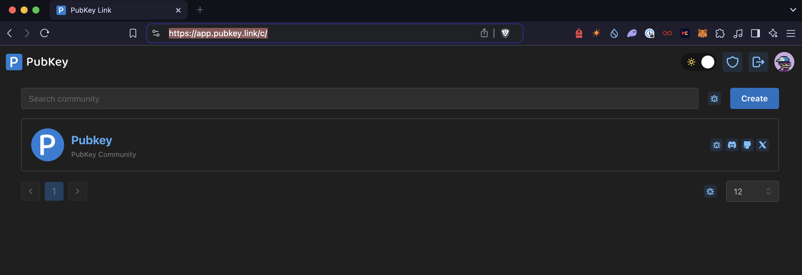
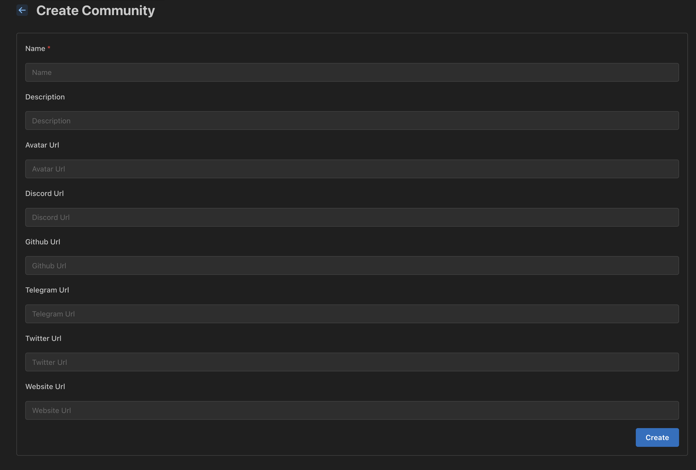

Now that you have a working setup, you can log in to your PubKey Link instance and configure your community and its roles and permissions.

### Create a Community

To get started with creating a community, navigate to the **Communities** tab and click the **Create** button. Fill in the relevant information to complete setup.

### Configure Community

After successfully creating your community, select it from the **Communities** tab to access your dashboard.

- **Configure a Discord Bot**
  To create a Discord bot for your instance, go to the **Discord** tab on the left-hand side. Enter the **Client ID**, **Client Secret**, and **Token** values that you collected earlier ([see the Environment Variables section](#Collect-environment-variables)).
  
  Once the bot is set up, you can use the available buttons to **Start**, **Stop**, **Manage**, or **Invite** the bot to your Discord server(s).

- **Create and Assign Roles**
  To create and assign roles, navigate to the **Roles** tab on the left-hand side and click the **Create** button. Provide a name for the role and follow the setup wizard:
  1. Select the asset type (fungible or non-fungible) and the amount required to obtain the role.
  2. After setting the conditions for acquiring the role, click the **Add Permission** button in the **Permissions** section.
  3. In the permissions configuration, choose the server where this condition will be checked and the Discord role to be awarded (ensure this role has already been created in your Discord server and is below the bot role in the hierarchy table).