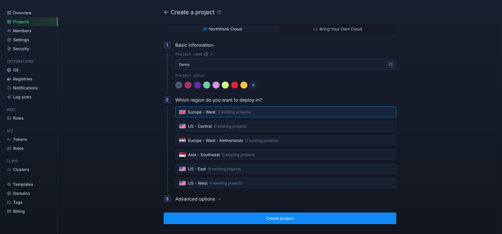
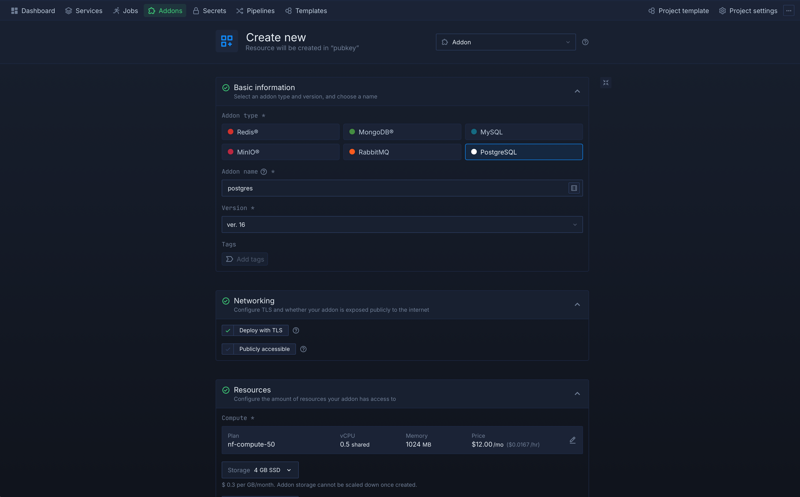
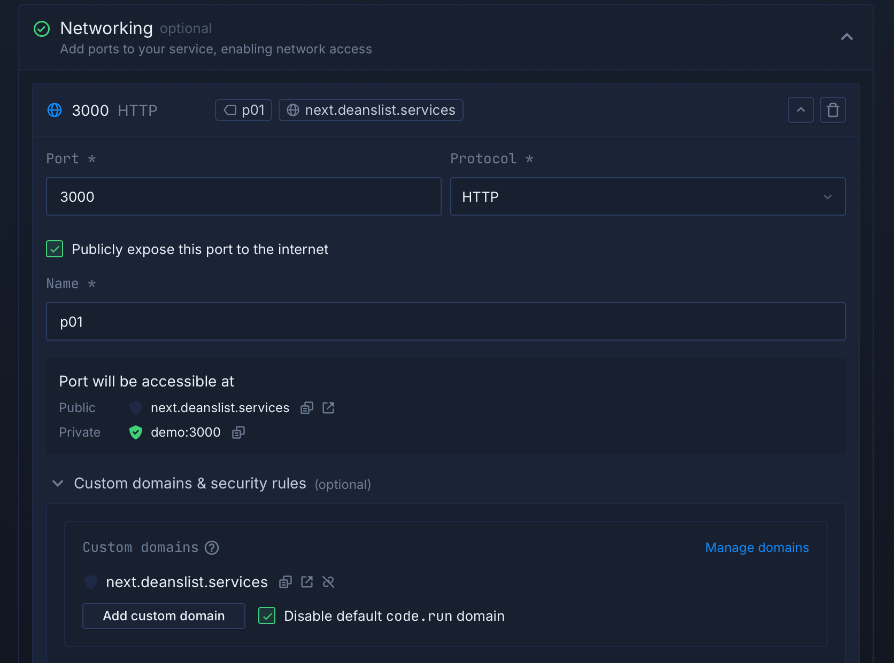

After collecting the required information in the previous step, follow these steps to get a working setup.

With the above information, you can configure the environment in your hosting infrastructure and start the container.

The Docker images are hosted on [GHCR](https://github.com/pubkeyapp/pubkey-link/pkgs/container/pubkey-link).

### Main branch (Recommended)

> Most instances probably want to use the `main` branch which is updated less often and more stable.
>
> `ghcr.io/pubkeyapp/pubkey-link:latest`

### Dev branch

> If you want to run the latest and greatest, or you like living on the edge, you can run the `dev` branch.
> 
> `ghcr.io/pubkeyapp/pubkey-link:dev`
> 
> After you start the container, the links on how to access the UI will be logged in the terminal.

### Northflank Installation

Follow the steps below to deploy PubKey Link on Northflank. This method allows you to easily manage databases, secrets, and services using Northflank's interface.

1. **Create a New Project**
   - Choose a name and region for your project
   
   

2. **Set Up Addons**
   - Navigate to the **Addons** tab.
     + Select the databases you need (PostgreSQL and Redis).
     + Choose a name, select the latest version, and enable the **Deploy with TLS** option.
     + Configure the resources you want to allocate to each database.
     
     

3. **Configure Secrets**
   - Go to the **Secrets** tab.
     + Choose a name for your secrets group (e.g., `databases`).
     + Set the **Type** field to `Secret Values`.
     + Ensure the **Scope** field is set to `Runtime`.
     + Under the **Secrets** section, add all the environment variables you collected earlier.
     
     
     
     + Link the created Postgres and Redis addons:
        1. Configure the Postgres addon to set the `POSTGRES_URI` variable with the alias `DATABASE_URL`.
        2. Configure the Redis addon to set the `REDIS_MASTER_URL` variable with the alias `REDIS_URL`.
    
    

    

4. **Create and Configure a Service**
   - Go to the **Services** tab.
      + Create a new service (e.g., name it `api`).
      + Select the **Deploy Docker Image** option.
      + Under the **Deployment** section, choose **External Image** and paste the PubKey image URL (`ghcr.io/pubkeyapp/pubkey-link:latest` or `ghcr.io/pubkeyapp/pubkey-link:dev`).
     
     

     
    - In the **Networking** section:
        + Check **Publicly expose this port to the internet**.
        + Under **Custom domains & security rules**, select the domain you previously created and [linked](https://northflank.com/docs/v1/application/getting-started/add-a-and-verify-domain). Check the box to disable the default `.run` domain.

        
        

    - Allocate the necessary resources to the service.